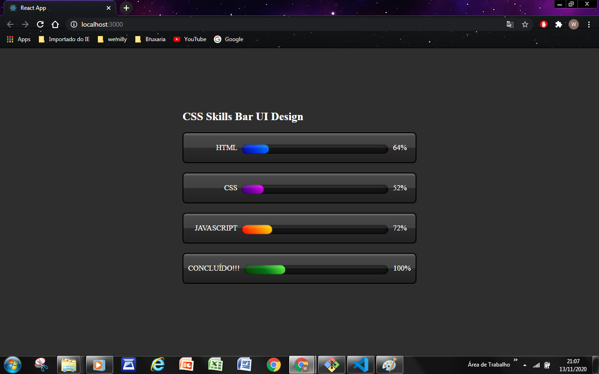
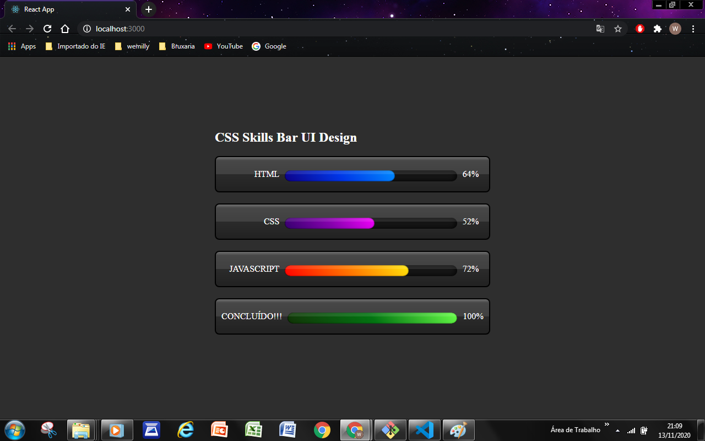
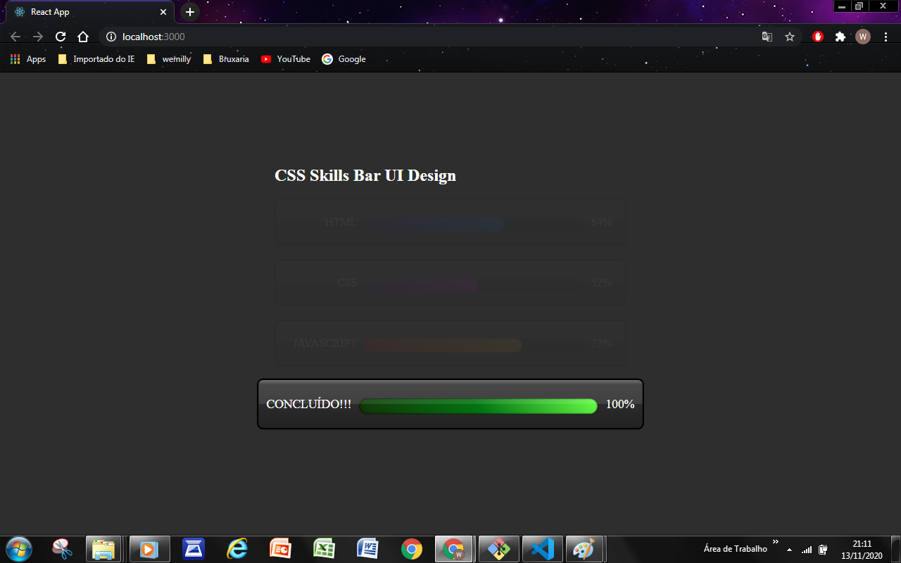

# Skills

 ### Design de interface do usuário da barra de habilidades animada CSS3 com efeitos interessantes de foco

 <b></b>

 <b></b>

 <b></b>

 ## Eu fiz ele com: 

<li><a href="https://developer.mozilla.org/pt-BR/docs/Web/HTML">HTML5</a></li>
    <li><a href="https://developer.mozilla.org/pt-BR/docs/Web/CSS">CSS3</a></li>
    <li><a href="https://pt-br.reactjs.org/">React.js</a></li>

## 📫 Contatos   

   